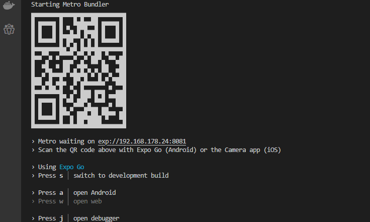

# NiceQuotes

## Overview

NiceQuotes is a small app written in JavaScript using the Expo framework. It allows Firebase cloud-based or with SQLite noSQL databases creation, reading, saving, and deleting of quotes with authors.

## Table of Contents

[NiceQuotes](#nicequotes)
- [Overview](#overview)
- [Table of Contents](#table-of-contents)
- [Installation](#installation)
- [Usage](#usage)
- [Technical Details](#technical-details)
- [Contribution](#contribution)
- [License](#license)

## Installation

1. Clone the repository:
```bash
git clone https://github.com/HolgerS2512/NiceQuotes.git
```

2. Install dependencies
```bash
npm install
```

## Usage

1. Download Expo Go for your smartphone [https://expo.dev/client](https://expo.dev/client)

2. Start Metro bundler
```bash
npx expo start
```
- Secure Mode
```bash
npx expo start --tunnel
```


3. Scan QR code and connect

## Technical Details
- **Language**: The app is written in JavaScript ES6.
- **Frameworks**: NiceQuotes uses Expo to create native apps based on react.
- **Storage**: Currently via a test cloud from Firebase. It is possible to replace Firebase with SQLite when exchanging comments.

## Contribution
Contributions to the NiceQuotes project are welcome! If you have improvements, bug fixes, or new features to suggest, please create a pull request or open an issue on the GitHub repository.

## License

MIT
